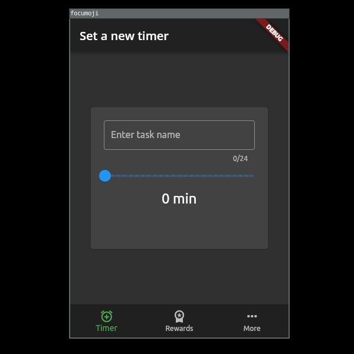
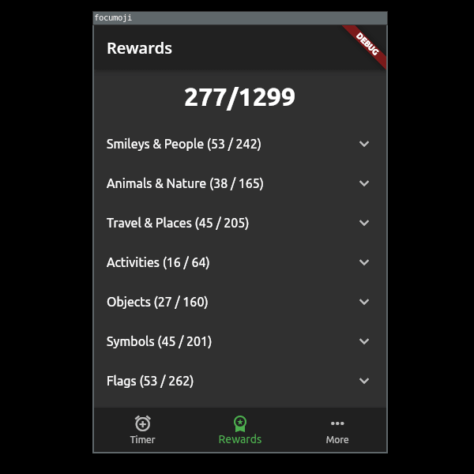

# FocuMoji

FocuMoji is a Flutter project that combines productivity with fun by offering a unique focus timer experience. This app allows users to set up custom timers and, upon successful completion, rewards them with a collection of 1299 emojis to unlock. These emojis are categorized and displayed on the rewards screen. Unlocked emojis are highlighted with a yellow background, and users can tap on them to view when they were unlocked and which timer led to their unlock.





## Features

- **Customizable Timers**: Users can set up timers with their preferred durations and names to suit their work or study habits.

- **Emoji Rewards**: Unlock a total of 1299 emojis by successfully completing timers.

- **Categorized Emojis**: Emojis are organized into categories, making it easy to browse through and find your favorites.

- **Unlock History**: View when each emoji was unlocked and which timer led to its unlock.

## Getting Started

Follow these simple steps to run the FocuMoji project on your local machine:

### Prerequisites

- Ensure you have [Flutter](https://flutter.dev/docs/get-started/install) installed on your system.

### Installation

1. Clone this repository to your local machine:

   ```shell
   git clone https://github.com/WojDob/FocuMoji.git
   ```

2. Navigate to the project directory:

   ```shell
   cd FocuMoji
   ```

3. Install dependencies:

   ```shell
   flutter pub get
   ```

4. Run the app:

   ```shell
   flutter run
   ```

## Usage

1. Launch the FocuMoji app on your device.

2. Set up a custom timer by specifying the duration and giving it a name.

3. Start the timer.

4. Focus on your task until the timer completes.

5. Once the timer completes, you'll be rewarded with emojis.

6. Go to the rewards screen to view and explore your unlocked emojis by category.

7. Tap on an unlocked emoji to see when it was unlocked and which timer led to its unlock.


## Acknowledgments

I would like to acknowledge the Flutter community for their valuable contributions to the development ecosystem.

---

Happy focusing and emoji unlocking with FocuMoji! 🎯🎉